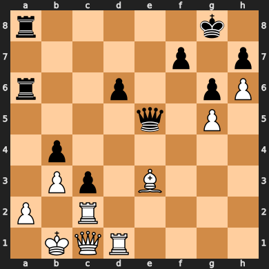

# Morning Briefing for Wednesday, November 01, 2023
## Weather
Current weather in Lincoln, GB is overcast clouds with a temperature of 10.11°C. Overall forecast for Lincoln, GB today is light rain with an average temperature of 9.8°C.
## Maths Problem of the Day
A millionaire offers you the chance to double your money. You can either take the offer or hand the money over to him. What is the minimum amount of money you must have in order to make the most profitable decision?
## Today's Math Research Highlights from arXiv
1. [The Mathematical Universe in a Nutshell](http://arxiv.org/abs/math/0208009v1)
2. [Brief Lecture Notes on Self-Referential Mathematics, and Beyond](http://arxiv.org/abs/0905.0227v1)
3. [Some problems in mathematics and mathematical physics](http://arxiv.org/abs/2011.12141v2)
4. [Categories without structures](http://arxiv.org/abs/0907.5143v2)
5. [Instantons: topological aspects](http://arxiv.org/abs/math/0509348v1)
## Today's Events
- MTH1001 (Algebra) from 12:00 to 13:00
- MTH1002 (Calculus) from 10:00 to 11:00
## Today's Chess Puzzle
Puzzle FEN: 2r3k1/p3Q1bp/b4pp1/4P3/1p3P2/5N1P/1q1K2P1/1N1R2R1 w - - 0 23
Rating: 1452
Solution: ['d2e1', 'b2e2']

## Today's Haiku
Trust is your own stride,
Luck's but a fleeting whisper,
Confidence shouts loud.
## To-Do List
📜 Quest Log:
  - Auto-generate morning briefings with ChatGPT and Python
  - Shop
  - Mirin
  - Decide which beats go out or need extending etc. - name and cover art. Should it be a single, tape, etc.?
  - Release stuff?
  - Added more - listen!
  - START!!
  - START!!
  - START!!
  - ANKI!!
  - Update notes with the lecture material
  - Create flashcards on the notes
  - Complete the [[Answers to Calculus Practical 6]]
  - Do some extra reading - combining new knowledge into existing notes
  - Do some extra practice
  - Update notes with the lecture material
  - Create flashcards on the notes
  - Complete the [[Answers to Algebra Practical 6]]
  - Do some extra reading - combining new knowledge into existing notes
  - Do some extra practice
  - Update notes with the lecture material
  - Create flashcards on the notes
  - Complete the [[Answers to Mechanics Practical 3]]
  - Download coursework
  - Do some extra reading - combining new knowledge into existing notes
  - Do some extra practice
  - Complete my little turtle game
  - Download coursework
